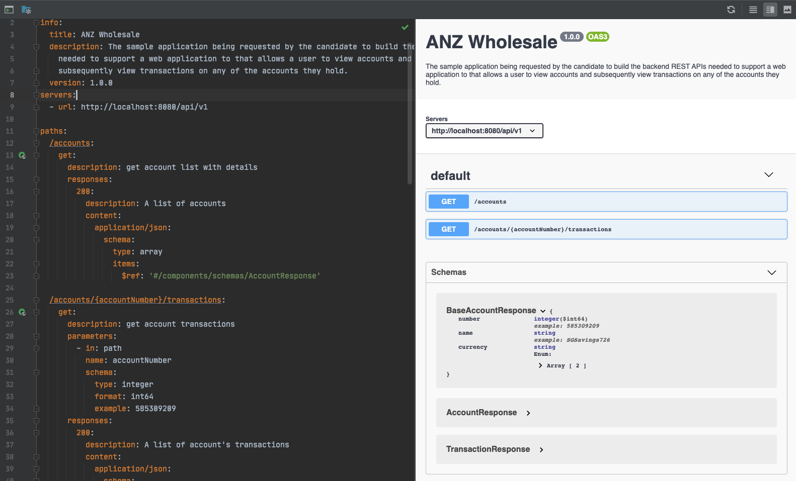
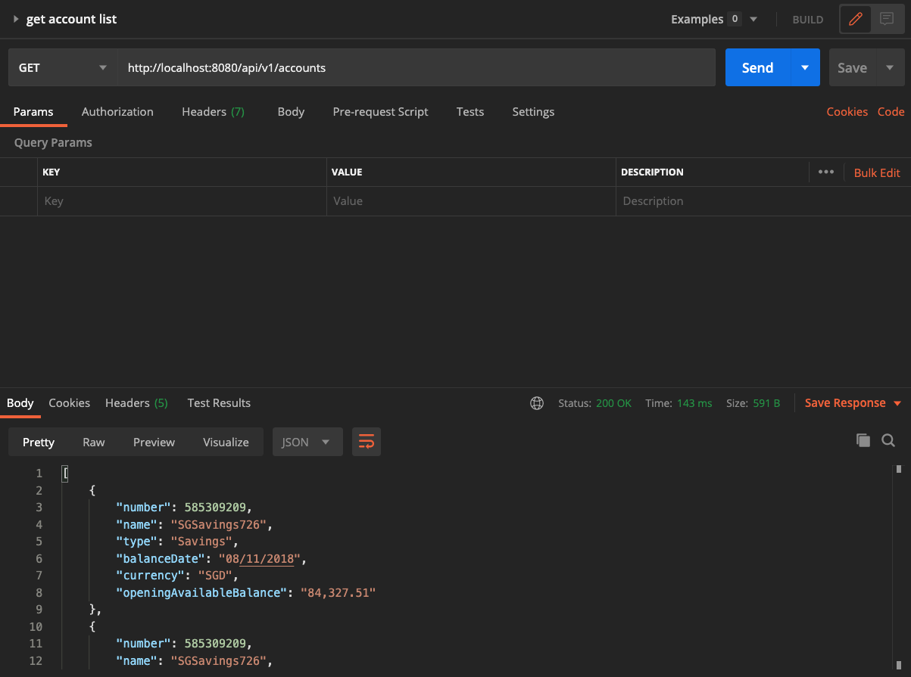
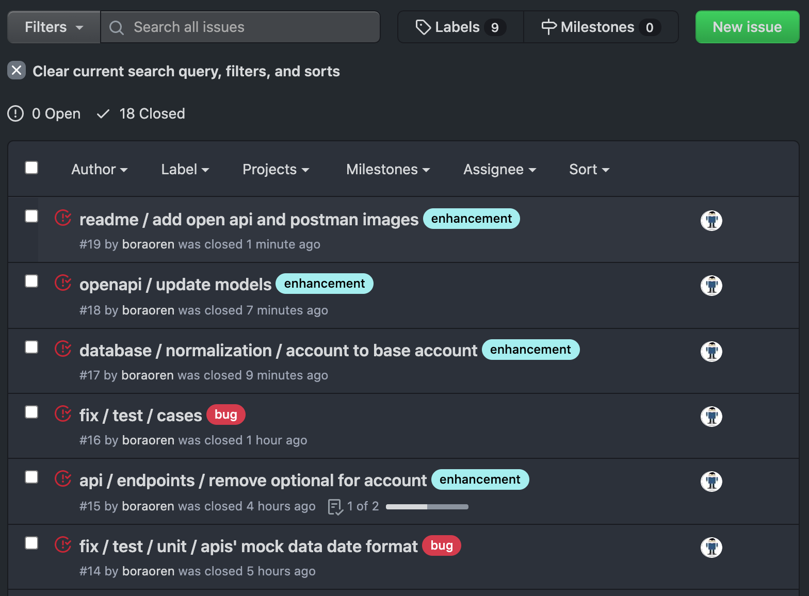

# About the project

to build the backend REST APIs needed to support a web application 
to that allows a user to view accounts and subsequently view 
transactions on any of the accounts they hold.

## Required functionality

- [view account list](http://localhost:8080/accounts)
- [view account transactions](http://localhost:8080/api/v1/accounts/585309209/transactions)

please check open [api documentation](anz-wholesale-api.yaml)

# Getting Started

## Prerequisites

1. java
    1. install sdkman `https://sdkman.io/install`
    1. install java `sdk install java`

## Installation
1. Clone the repo
run `git clone https://github.com/boraoren/project-wholesale.git`
1. Download dependencies
run `./gradlew clean build`

# Usage

## Run Application
1. run `./gradlew bootRun`
2. to get __account list__ open link 
`http://localhost:8080/api/v1/accounts`
3. to get __transaction list__ of account number `585309209` 
`http://localhost:8080/api/v1/accounts/585309209/transactions`

for detail you can check [api documentation](#generate-and-view-api-documentation)

## Run Test
`./gradlew test`

## Generate and View API documentation
1. run `./gradlew clean asciidoctor`
2. check `build/asciidoc/html5` folder for index.html 
and open it with web browser

## Use Postman
import `anz-wholesale.postman_collection.json` file to postman

## Issues
you can check issues for github [here](https://github.com/boraoren/project-wholesale/issues?q=)

 

